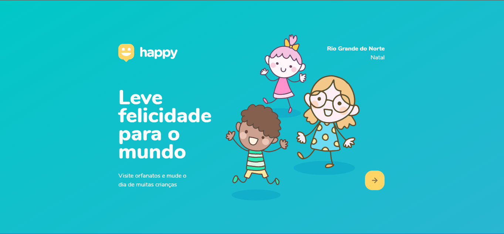
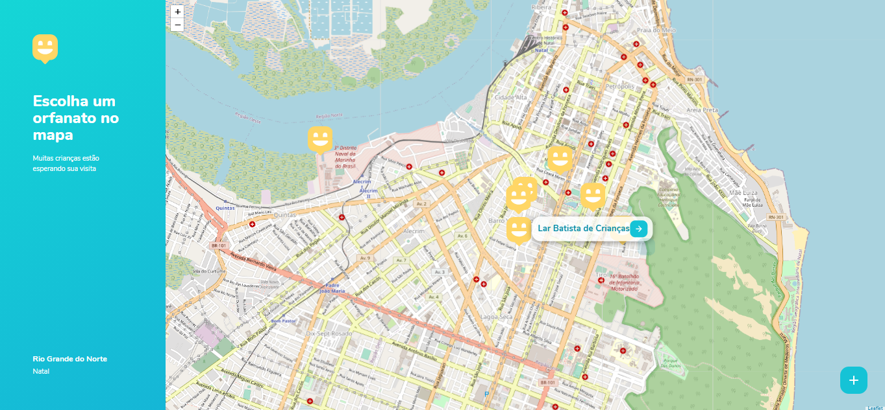
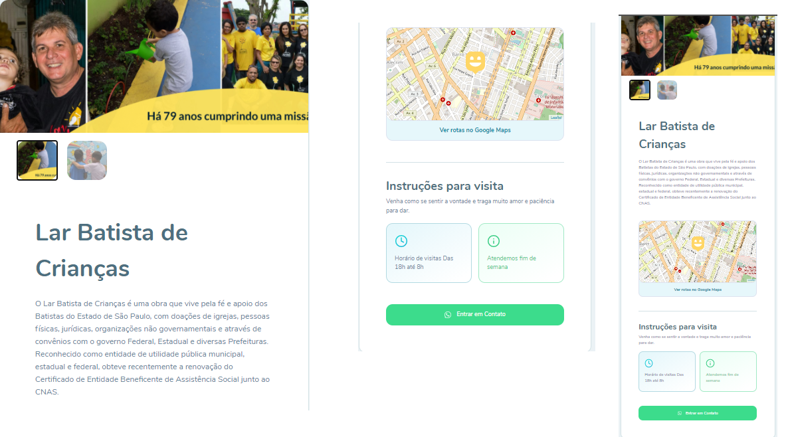

<h3 align="center">
    
    <br><br>
    <b>Conecte pessoas a orfanatos e traga felicidade as crianças!</b>  
    <br>
</h3>

<p align="center">
  <a href="https://rocketseat.com.br">
    
  </a>
  <a>
</p>

# Índice

- [Sobre](#sobre)
- [Documentação](#documentacao)
- [Tecnologias Utilizadas](#tecnologias-utilizadas)
- [Como Usar](#como-usar)
- [Como Contribuir](#como-contribuir)

<a id="sobre"></a>

## :bookmark: Sobre

O <strong>Happy</strong> é uma aplicação Web voltado para pessoas encontrem orfanatos perto de sua casa e levar mais felicidade para as crianças.
<br/>
Essa aplicação foi construída na trilha  da <strong>Next Level Week 3.0</strong> distribuída pela [Rocketseat](https://rocketseat.com.br/). 
<br/>
A ideia de criar uma aplicação voltada as crianças surgiu da coincidência da data do curso e data do <strong>evento cair no dia 12 de outubro, dia das crianças.</strong>

<a id="documentacao"></a>

## :books: Documentação

Para reforçar alguns conceitos e registrar comandos que são dificeis de se lembrar eu fiz uma pequena **[DOCUMENTAÇÃO](DOCUMENTATION.md)** para ajudar quem esta iniciando com **Javascript**, **Node**, **Html** e **Css**.

<a id="tecnologias-utilizadas"></a>

## :rocket: Tecnologias Utilizadas

O projeto foi desenvolvido utilizando as seguintes tecnologias

- [Html](https://developer.mozilla.org/pt-BR/docs/Aprender/HTML/Introducao_ao_HTML)
- [JavaScript](https://developer.mozilla.org/pt-BR/docs/Web/JavaScript)
- [Node.js](https://nodejs.org/en/)
- [Sqlite](https://sqlite.org/docs.html)

## :heavy_check_mark: :computer: Resultado Web

- O layout está disponível no **[Figma](https://www.figma.com/file/qNB37rEHcaC13HBjO8F27T/Happy-Web-(Copy)?node-id=0%3A1)**;

<h1 align="center">.
    
</h1>

## :heavy_check_mark: :iphone: Resultado Web

<h1 align="center">
    
    
    
</h1>


<a id="como-usar"></a>

## :fire: Como usar

- ### **Pré-requisitos**

  - É **necessário** possuir o **[Node.js](https://nodejs.org/en/)** instalado na máquina
  - Também, é **preciso** ter um gerenciador de pacotes seja o **[NPM](https://www.npmjs.com/)** ou **[Yarn](https://yarnpkg.com/)**.
  - Por fim, é **essencial** ter o **[Expo](https://expo.io/)** 
  instalado de forma global na máquina

1. Faça um clone :

```sh
  $ git clone https://github.com/Rafael-Rufino/NLW_Happy.git
```

2. Executando a Aplicação:

```sh
  # Instale as dependências
  $ npm install

  ## Crie o banco de dados
  $ cd server
  $ npm run knex:migrate
  $ npm run knex:seed


  # Inicie a aplicação web
  $ cd NLW_Happy
  $ npm start

```

<a id="como-contribuir"></a>

## :recycle: Como contribuir

- Faça um Fork desse repositório,
- Crie uma branch com a sua feature: `git checkout -b my-feature`
- Commit suas mudanças: `git commit -m 'feat: My new feature'`
- Push a sua branch: `git push origin my-feature`

## :mortar_board: Quem ministrou?

As aulas foram ministradas pelo mestre **[Mayk Brito](https://github.com/maykbrito)** nas aulas da **Next Level Week**.

## :memo: License

Esse projeto está sob a licença MIT. Veja o arquivo [LICENSE](LICENSE.md) para mais detalhes.

---

<h4 align="center">
    Feito com 💜 by <a href="https://www.linkedin.com/in/rafael-rufino-b889311ba/" target="_blank">Rafael Rufino</a>
</h4>
